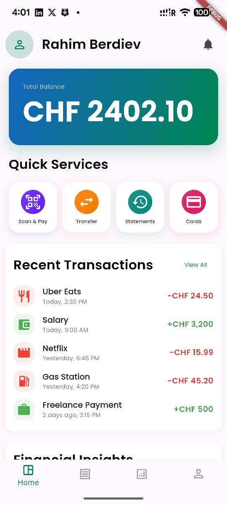
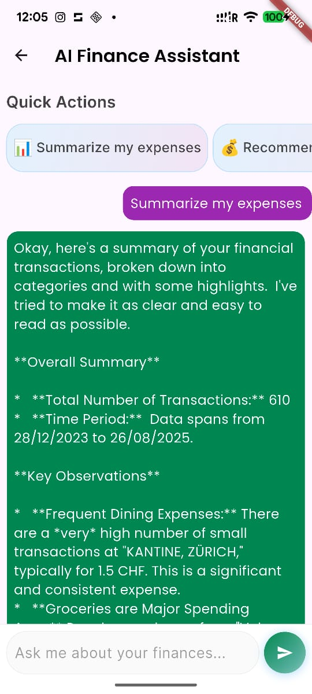
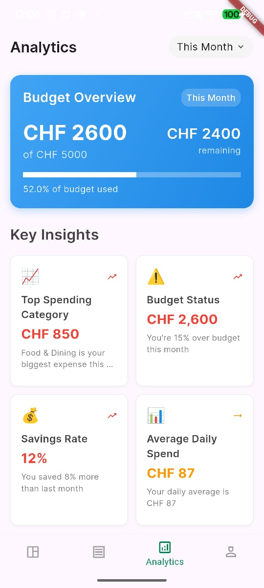
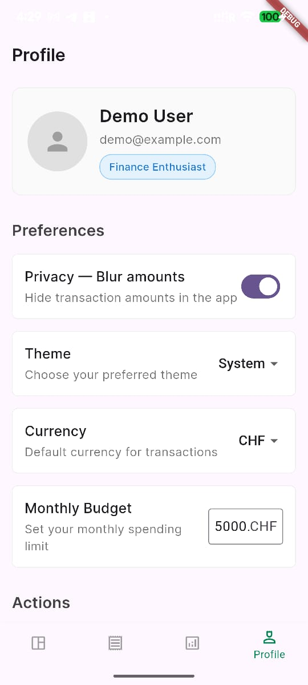

# AI Finance Manager

A prototype Personal Financial Management (PFM) mobile application developed for the **SGKB x IBM START Hack Tour 2025**. This project demonstrates how Generative AI can enhance users' financial well-being by providing insightful analysis and a conversational interface to manage expenses.




## The Challenge

**Case:** Personal Financial Management (PFM): Categorisation & enrichment of expenses using GenAI

**Presented by:** St.Galler Kantonalbank (SGKB) and IBM

The primary challenge was to address the limited insight users have into their spending habits. The goal was to develop a prototype UI for an AI Finance Manager that could:

- Automatically categorize bank transactions.
- Provide a conversational interface for financial queries.
- Visualize spending patterns and derive actionable insights.

## Our Solution

We developed a Flutter-based mobile application that provides users with a clear, intuitive, and intelligent way to manage their finances.

### Key Features

#### 1. Modern & Intuitive Dashboard

The home screen provides a comprehensive overview of the user's financial status at a glance.

- **Total Balance:** A clear and prominent display of the user's total balance.
- **Quick Services:** Easy access to common actions like "Scan & Pay", "Transfer", and "Statements".
- **Recent Transactions:** A live feed of the latest transactions.
- **Financial Insights:** A summary of monthly income, expenses, and savings rate.
- **Spending by Category:** A visual breakdown of spending across different categories.

#### 2. AI-Powered Conversational Assistant

Users can have a natural conversation about their finances with our AI assistant, powered by **Google's Gemini API**.

- **Context-Aware Advice:** The AI is fed the user's transaction data (in a secure, anonymized manner) to provide personalized summaries, insights, and advice.
- **Pre-defined & Custom Queries:** Users can use quick-action chips for common questions or type their own queries.

#### 3. Smart Transaction Categorization

The application automatically categorizes transactions to provide a meaningful breakdown of spending. For the hackathon, this is implemented using a client-side rules-based engine.

## Screenshots

Here's a gallery of the application's main screens.

| Home Page | AI Chat Assistant | Expenses Overview |
| :---: | :---: | :---: |
|  |  |  |

| Analytics | Profile |
| :---: | :---: |
|  |  |


## Tech Stack

*   **Frontend (Mobile App):**
    *   Flutter & Dart

*   **Generative AI:**
    *   Google Gemini API for the conversational chat feature.

## Getting Started

### Prerequisites

- Flutter SDK installed.

### Run the Flutter App

```bash
# Get Flutter packages
flutter pub get

# Run the app on your connected device or emulator
flutter run
```

---

Built with ❤️ for the **SGKBxIBM_START_Hack_Tour25** by **Code of Duty**.